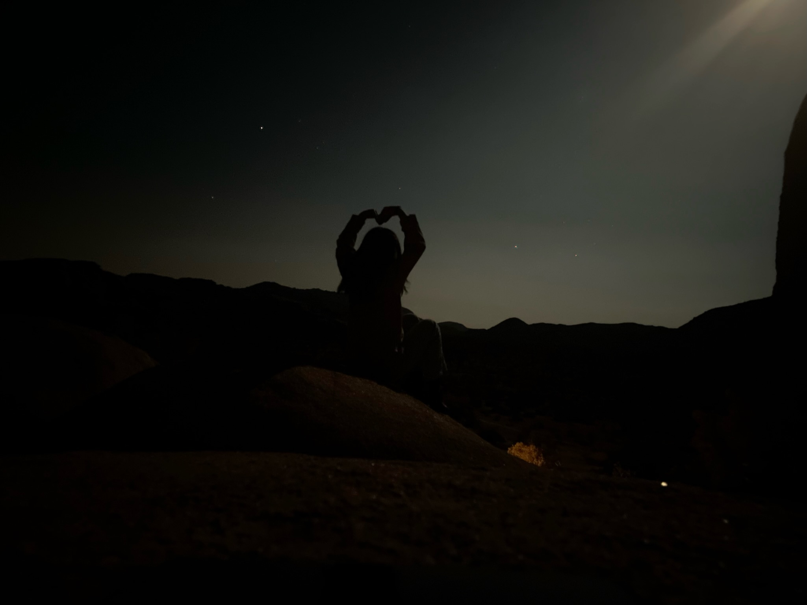
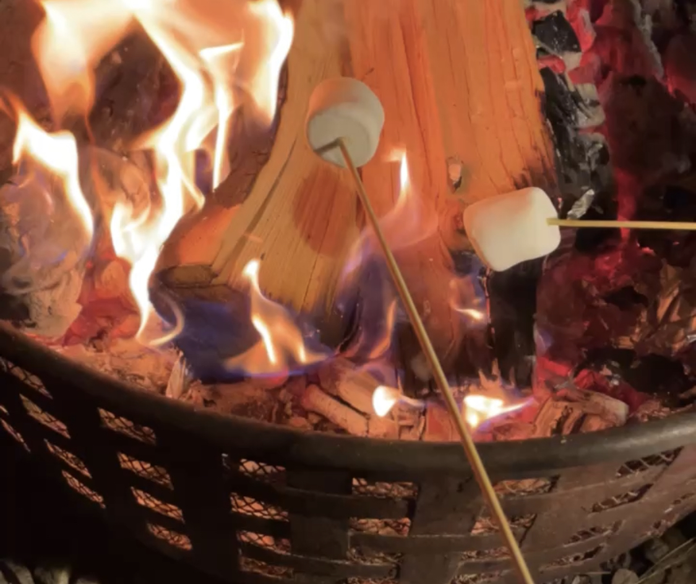

# Hi this is Zhaoyu Zhang!
### Junior CS student of UCSD
###### Expected June 2024 

<br/>



#### My hobbies are **_cooking_ and _sleeping_**~~, even though sometimes I cannot cook and sleep well~~.

<br/>

> #### I love matcha latte with coconut milk and all icecreams 🥰, so my friends often call me *icecream killer*.

<br/>

---

<br/>

#### Besides eating icecreams, I am also good at coding. 


#### Here's a piece of my sample code:

```
import torch

x = torch.arange(3)
y = torch.tensor([1,2,3])

print(x @ y.T)
```

#### This will give out:

```
8
```

<br/>

---

<br/>

#### Welcome to follow me on [LinkedIn](https://www.linkedin.com/in/zhaoyu-zhang/) and [Instagram](https://www.instagram.com/tinatntntnt/)!!!

#### Click [here](#zhaoyu-zhang) to go back to the start of my personal page!

#### This is [bugcat capoo](tumblr_obzaf5skq21udszxdo1_500.gif), hope it can bring you joy and happiness~


<br/>

---

<br/>

I am trying to find inner peace, and here are some of the actions I tried:
1.  Sleep over 8 hours
2.  Exercising
3.  Meeting friends
4.  Keeping diaries

But they fail to cheer me up sometimes. If any of you have good suggestions, I would be very grateful!

<br/>

---

<br/>

There are a lot of interesting things that I want to try:

- Practice the Piano of _Only My Raligun_
- Learn 3D printing to make muself a hair pin and a ring
- Make Taro Cake
- Learn Kendo 

<br/>

---

<br/>

Before that I have a lot of courseworks to finish:

- [x] Go to CSE 110's lab
- [ ] Reading D2L for CSE 151B
- [ ] Workspace assignment for SYN 2
- [ ] PA for CSE 151B
- [ ] Reading for CSE 101

<br/>

---

<br/>

Have a good day~


###### Fell in love with Marshmallows!


